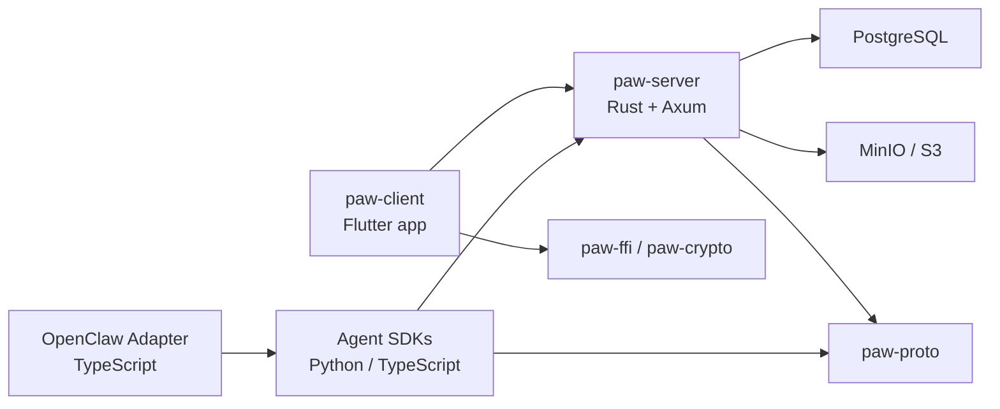

# Paw Messenger 한국어 안내서

Paw는 사람과 AI 에이전트가 같은 메신저 환경에서 대화할 수 있도록 설계된 AI-네이티브 메시징 플랫폼입니다. 이 저장소는 Rust 서버, Flutter 클라이언트, 공용 프로토콜, 암호화 크레이트, 에이전트 SDK, OpenClaw 어댑터를 함께 관리하는 모노레포입니다.

기존 [README.md](/Users/joy/workspace/paw/README.md)는 짧은 소개에 가깝고, 이 문서는 실제로 저장소를 열었을 때 필요한 구조 이해, 실행 순서, 서브프로젝트 역할, 참고 문서 위치를 더 자세히 정리한 안내서입니다.

## 1. 프로젝트 개요

Paw가 해결하려는 문제는 "일반 사용자 대화", "에이전트 응답", "실시간 스트리밍", "향후 E2EE 확장"을 하나의 메시징 프로토콜과 클라이언트 경험으로 묶는 것입니다.

핵심 특징:

- Rust/Axum 기반 서버로 REST API와 WebSocket 게이트웨이를 함께 제공
- Flutter 클라이언트로 모바일, 데스크톱, 웹을 한 코드베이스로 지원
- 공용 프로토콜 크레이트(`paw-proto`)로 서버와 SDK 간 메시지 형식 일치
- Rust 기반 암호화/FFI 계층으로 Flutter에서 네이티브 암호 기능 활용
- Python/TypeScript SDK 및 OpenClaw 어댑터로 에이전트 생태계 확장

## 2. 저장소를 한눈에 보기



### 최상위 디렉터리 역할

| 경로 | 역할 |
|---|---|
| `Cargo.toml` | Rust 워크스페이스 루트. `paw-server`, `paw-proto`, `paw-crypto`, `paw-ffi`를 묶습니다. |
| `paw-server/` | REST API, 인증, 메시지, 채널, 미디어, 마켓플레이스, 백업, 관리자 기능을 담당하는 서버입니다. |
| `paw-proto/` | WebSocket 및 에이전트 스트리밍에 쓰이는 공용 메시지 타입입니다. |
| `paw-crypto/` | E2EE 실험 및 암호 관련 Rust 코드입니다. 현재 `mls` 모듈을 노출합니다. |
| `paw-ffi/` | Flutter에서 Rust 암호 기능을 호출하기 위한 FFI 계층입니다. |
| `paw-client/` | Flutter 앱입니다. Riverpod, go_router, Drift, flutter_rust_bridge를 사용합니다. |
| `agents/paw-agent-sdk/` | Python 에이전트 SDK입니다. |
| `adapters/paw-sdk-ts/` | TypeScript 에이전트 SDK 패키지(`@paw/sdk`)입니다. |
| `adapters/openclaw-adapter/` | OpenClaw 연동용 TypeScript 어댑터입니다. |
| `docs/` | 아키텍처, 프로토콜, 운영, SDK, 벤치마크, 도그푸딩 문서를 모아둔 폴더입니다. |
| `docker-compose.yml` | 로컬 개발용 PostgreSQL, MinIO, NATS 컨테이너를 띄웁니다. |
| `Makefile` | 서버 실행, 테스트, 포맷, 린트, 마이그레이션 명령을 단축합니다. |

## 3. 기술 스택

### 서버

- Rust 2021
- Axum 0.8
- Tokio
- SQLx + PostgreSQL
- async-nats
- AWS S3 SDK (MinIO 호환)
- JWT 인증

### 클라이언트

- Flutter 3 계열
- Riverpod
- go_router
- Drift + SQLCipher
- flutter_rust_bridge
- flutter_secure_storage

### SDK / 어댑터

- Python 3.11+
- TypeScript 5
- `ws`
- Jest

## 4. 핵심 런타임 구성

### 서버 엔트리

서버 엔트리는 [paw-server/src/main.rs](/Users/joy/workspace/paw/paw-server/src/main.rs) 입니다. 이 파일에서 다음이 한 번에 조립됩니다.

- 환경변수 로딩
- PostgreSQL 연결 풀 생성
- WebSocket 허브 생성
- MinIO/S3 기반 미디어 서비스 생성
- NATS 연결 시도
- 인증 미들웨어가 적용된 보호 라우트 구성
- 공개 라우트와 WebSocket 라우트 등록

등록된 주요 기능군:

- 인증: OTP 요청, OTP 검증, 디바이스 등록, 토큰 갱신
- 사용자: 내 정보 조회/수정, 사용자 검색, 프로필 조회
- 대화/메시지: 대화 생성, 메시지 전송/조회, 멤버 관리
- 에이전트: 등록, 초대, 제거, 마켓플레이스 조회/설치
- 채널: 브로드캐스트 채널 생성, 구독, 메시지 조회/전송
- 키 관리: 프리키 업로드/조회
- 미디어: 업로드, 다운로드 URL 발급
- 백업: 생성, 조회, 복원, 삭제, 설정
- 운영/안전: 신고, 차단, 관리자 정지, 푸시 토큰 등록
- 실시간: `/ws`, `/agent/ws`

### 클라이언트 엔트리

클라이언트 엔트리는 [paw-client/lib/main.dart](/Users/joy/workspace/paw/paw-client/lib/main.dart) 입니다.

초기화 순서:

1. Flutter 바인딩 초기화
2. Rust 초기화 (`initRust()`)
웹에서는 no-op, 네이티브에서만 FRB 초기화
3. 서비스 로케이터 설정
4. 데스크톱 환경이면 시스템 트레이/단축키 등록
5. `ProviderScope`로 앱 시작

이 구조를 보면 Paw 클라이언트는 단순한 채팅 UI가 아니라 Rust 기반 기능과 데스크톱 기능까지 고려된 앱으로 설계돼 있습니다.

### 공용 프로토콜

[paw-proto/src/lib.rs](/Users/joy/workspace/paw/paw-proto/src/lib.rs) 에는 다음이 정의돼 있습니다.

- `ClientMessage`
- `ServerMessage`
- `InboundContext`
- `AgentResponseMsg`
- `AgentStreamMsg`
- 스트리밍 프레임(`StreamStart`, `ContentDelta`, `ToolStart`, `ToolEnd`, `StreamEnd`)

중요한 점:

- 모든 메시지에 버전 필드 `v`가 들어갑니다.
- 일반 채팅과 에이전트 스트리밍 프로토콜이 같은 타입 체계 안에 정리돼 있습니다.
- SDK와 서버가 같은 프로토콜 개념을 공유하기 쉬운 구조입니다.

## 5. 빠른 시작

### 5.1 사전 준비

최소 필요 조건:

- Rust 툴체인
- Cargo
- Docker / Docker Compose
- Flutter SDK
- PostgreSQL 클라이언트 도구(선택)
- Python 3.11+ 또는 Node.js 20+ (SDK/어댑터를 만질 경우)

### 5.2 환경변수 준비

루트의 [.env.example](/Users/joy/workspace/paw/.env.example) 를 기준으로 환경변수를 준비합니다.

주요 값:

- `DATABASE_URL`
- `S3_ENDPOINT`
- `S3_BUCKET`
- `S3_ACCESS_KEY`
- `S3_SECRET_KEY`
- `STORAGE_BACKEND`
- `S3_FORCE_PATH_STYLE`
- `JWT_SECRET`
- `OTP_PROVIDER`

개발 기본값 기준으로는 PostgreSQL은 `localhost:35432`, MinIO는 `localhost:39080`, 서버는 `:38173`을 사용합니다.

### 5.3 의존 서비스 실행

루트의 [docker-compose.yml](/Users/joy/workspace/paw/docker-compose.yml) 은 다음 서비스를 띄웁니다.

- `postgres`
- `minio`
- `nats`

실행:

```bash
docker compose up -d
```

또는 Makefile 사용:

```bash
make docker-up
```

### 5.4 서버 실행

```bash
cargo run -p paw-server
```

또는:

```bash
make server
```

개발 편의용으로 컨테이너 시작과 서버 실행을 묶은 타깃도 있습니다.

```bash
make dev
```

### 5.5 데이터베이스 마이그레이션

[Makefile](/Users/joy/workspace/paw/Makefile) 에 정의된 명령:

```bash
make migrate
```

새 마이그레이션 생성:

```bash
make migrate-add name=create_something
```

현재 서버 마이그레이션은 `20260101000001`부터 `20260101000019`까지 존재하며, 사용자/디바이스/OTP/대화/메시지/미디어/읽음 상태/프리키/채널/푸시/백업/마켓플레이스/성능 인덱스/모더레이션까지 커버합니다.

### 5.6 Flutter 클라이언트 실행

서버와 클라이언트를 한 번에 띄우려면:

```bash
./scripts/run-local-dev.sh
```

기본 디바이스는 `chrome`이며, 다른 디바이스를 지정할 수도 있습니다.

```bash
./scripts/run-local-dev.sh macos
```

전체를 멈추고 의존 컨테이너까지 내리려면:

```bash
./scripts/stop-local-dev.sh
```

클라이언트만 따로 실행하려면:

```bash
cd paw-client
flutter pub get
flutter run
```

클라이언트는 Flutter만으로 끝나지 않고 `flutter_rust_bridge`와 Rust FFI를 사용하므로, 플랫폼별 개발 환경 구성이 필요할 수 있습니다.

### 5.7 웹 실행 시 주의사항

- 웹에서는 Rust FFI를 직접 로드하지 않도록 분리되어 있습니다.
- 따라서 `paw_ffi.js` 관련 MIME/type 에러는 정상 구성에서는 발생하지 않아야 합니다.
- 웹 세션 정책: 자동 세션 복원을 스킵하고, 사용자가 로그인 플로우를 명시적으로 완료해야 합니다.
- 네이티브 세션 정책: 저장 토큰 복원 후 `getMe` 검증에 실패하면 토큰을 즉시 폐기하고 로그인 화면으로 전환합니다.
- 보호 라우트(`/chat`, `/profile/me` 등)는 비인증 상태에서 접근 시 `/login`으로 강제 리다이렉트됩니다.
- `profile/me`/`conversations`는 토큰이 없으면 호출하지 않으며, 만료 시 401 처리 규칙에 따라 세션이 정리됩니다.
- WebSocket은 `connecting/connected/retrying/disconnected` 네 상태만 사용하며, `connected`는 서버 `hello_ok` 수신 후에만 성립합니다.

### 5.8 웹 E2E (Playwright)

웹 라우트 가드/콘솔 안정성 시나리오는 Playwright로 실행할 수 있습니다.

```bash
cd paw-client/e2e/playwright
npm install
npm run install:browsers
PAW_WEB_BASE_URL=http://127.0.0.1:38481 npm test
```

- 기본 시나리오: `/login` → `/chat` → `/profile/me` → 새로고침
- 루트에서 `make e2e-playwright`를 사용하면 Flutter web-server를 자동 기동한 뒤 같은 smoke 시나리오를 실행합니다.
- 통과 조건: console error/pageerror 0건

### 5.9 Flutter Integration Test (공식 E2E)

Flutter 공식 `integration_test/` 구조 기반 E2E는 아래처럼 실행합니다.

```bash
# 자동 디바이스 선택 (macos -> android -> ios -> chrome)
make e2e-flutter

# 디바이스 직접 지정
make e2e-flutter device=macos
make e2e-flutter device=chrome
make e2e-real
```

- 테스트 위치: `paw-client/integration_test/app_flow_test.dart`
- 웹(`chrome`)은 `flutter drive` 경로로 자동 실행됩니다.
- 웹 `flutter drive` 실행에는 `chromedriver`가 필요합니다.
- `chromedriver`가 없으면 스크립트가 Playwright smoke test로 자동 폴백합니다.
- 데스크톱/모바일은 `flutter test integration_test ... -d <device>` 경로를 사용합니다.
- `make e2e-real`은 로컬 서버를 자동 기동해 macOS `integration_test`로 로그인→대화목록→송수신→재시작 복원 루프를 검증합니다.

### 5.10 Back Office 준비 문서

기능 구현과 동시에 운영/CS/Admin 대비를 위해 아래 문서를 함께 갱신합니다.

- 기준 문서: [docs/backoffice/README.md](/Users/joy/workspace/paw/docs/backoffice/README.md)
- 백로그 매핑: [docs/backoffice/backlog-map.md](/Users/joy/workspace/paw/docs/backoffice/backlog-map.md)

## 6. 서브프로젝트별 상세 설명

### 6.1 `paw-server`

`paw-server`는 이 저장소의 중심입니다. 공개 API 서버, 인증 서버, 실시간 허브, 에이전트 게이트웨이 역할을 모두 수행합니다.

관심 있게 볼 폴더:

- `src/auth`: 인증 및 JWT 미들웨어
- `src/messages`: 대화/메시지 로직
- `src/agents`: 에이전트 등록, 초대, 마켓플레이스, 에이전트 WebSocket
- `src/channels`: 브로드캐스트 채널
- `src/media`: 업로드 및 미디어 URL 처리
- `src/backup`: 백업/복원
- `src/moderation`: 신고, 차단, 관리자 제재
- `src/push`: 푸시 토큰 및 대화 mute
- `src/ws`: 일반 사용자용 WebSocket 허브
- `migrations/`: SQLx 마이그레이션
- `tests/integration_test.rs`: 통합 테스트

서버 관점에서 Paw는 "메시징 API + 실시간 이벤트 허브 + 에이전트 브로커"에 가깝습니다.

### 6.2 `paw-client`

`paw-client`는 Flutter 기반 앱으로, 모바일만이 아니라 데스크톱과 웹도 같이 고려한 구조입니다.

`pubspec.yaml` 기준 핵심 구성:

- 상태관리: `flutter_riverpod`
- 라우팅: `go_router`
- DI: `get_it`
- 로컬 저장소: `drift`, `sqflite_sqlcipher`
- 네트워크: `http`, `web_socket_channel`
- 암호화: `cryptography`, `flutter_rust_bridge`
- 보안 저장소: `flutter_secure_storage`

현재 읽은 엔트리 기준으로 앱은 테마, 라우터, 데스크톱 기능, Rust 초기화가 이미 중심축에 있습니다. 즉, 단순 스캐폴드가 아니라 플랫폼 기능과 암호계층을 함께 붙이는 방향으로 진화한 구조입니다.

### 6.3 `paw-proto`

이 크레이트는 서버/클라이언트/SDK 경계를 가로지르는 계약입니다.

문서화 관점에서 특히 중요한 이유:

- 프로토콜 버전이 명시적입니다.
- 일반 메시징과 스트리밍이 한 곳에 모여 있습니다.
- 에이전트 게이트웨이 컨텍스트 구조가 드러납니다.

프로토콜 상세는 [docs/protocol-v1.md](/Users/joy/workspace/paw/docs/protocol-v1.md) 를 같이 보는 것이 좋습니다.

### 6.4 `paw-crypto` / `paw-ffi`

`paw-crypto`는 암호 로직의 Rust 측 구현 포인트이고, `paw-ffi`는 이를 Flutter에서 활용하기 위한 다리 역할을 합니다.

`paw-ffi`는 현재 다음 API를 재노출합니다.

- `create_account`
- `encrypt`
- `decrypt`
- `AccountKeys`

테스트도 함께 포함하고 있어, 최소한의 암호 연산 경로가 이미 Rust 레이어에 정리돼 있음을 알 수 있습니다.

### 6.5 Python Agent SDK

위치: `agents/paw-agent-sdk`

확인된 구성:

- `paw_agent_sdk/agent.py`
- `paw_agent_sdk/models.py`
- `paw_agent_sdk/streaming.py`
- `examples/echo_agent.py`
- `tests/test_models.py`

`pyproject.toml` 기준:

- Python 3.11+
- `websockets`
- `pydantic`

즉, Python SDK는 에이전트가 Paw 서버와 연결되어 메시지를 받고 응답하거나 스트리밍하기 위한 가벼운 통합 레이어로 보시면 됩니다.

### 6.6 TypeScript SDK

위치: `adapters/paw-sdk-ts`

패키지명:

- `@paw/sdk`

주요 파일:

- `src/agent.ts`
- `src/streaming.ts`
- `src/types.ts`
- `src/__tests__/agent.test.ts`

엔트리 [adapters/paw-sdk-ts/src/index.ts](/Users/joy/workspace/paw/adapters/paw-sdk-ts/src/index.ts) 에서 다음을 내보냅니다.

- `PawAgent`
- `StreamingContext`
- `PROTOCOL_VERSION`
- 메시지/스트리밍 관련 타입들

### 6.7 OpenClaw 어댑터

위치: `adapters/openclaw-adapter`

패키지명:

- `@paw/openclaw-adapter`

주요 파일:

- `src/adapter.ts`
- `src/channel.ts`
- `src/e2ee.ts`
- `src/types.ts`
- `examples/slack-bot.ts`

이 어댑터는 Paw 자체 SDK 위에서 외부 채널 또는 OpenClaw 환경과의 연결 지점을 제공하는 레이어입니다.

## 7. 개발 명령 모음

[Makefile](/Users/joy/workspace/paw/Makefile) 기준 자주 쓰는 명령은 아래와 같습니다.

```bash
make              # help 출력
make bootstrap-local  # 로컬 의존성 설치 및 저장소 준비
make local-stack      # postgres/minio 시작, 마이그레이션, 서버 실행
make dev          # docker-up + 서버 실행
make server       # paw-server 실행
make test         # cargo test --workspace
make lint         # cargo clippy --workspace -- -D warnings
make fmt          # cargo fmt --all
make clean        # cargo clean
make docker-up    # 개발용 컨테이너 실행
make docker-down  # 개발용 컨테이너 종료
make migrate      # SQLx migration 실행
```

주의할 점:

- `make`만 입력하면 아무 서비스도 실행하지 않고 도움말만 출력합니다.
- `make test`, `make lint`, `make fmt`는 Rust 워크스페이스 중심입니다.
- Flutter 테스트/분석이나 TypeScript 패키지 빌드는 각 서브프로젝트 디렉터리에서 별도로 실행해야 합니다.

## 8. 클라우드 스토리지 운영 계획 (AWS + GCP)

현재는 AWS SDK 기반 스토리지 어댑터를 공용 키/버킷/엔드포인트 설정으로 추상화해 두었고, `STORAGE_BACKEND`를 통해 런타임 동작을 분기합니다.

- `aws` (기본): MinIO/로컬, AWS S3에서 사용 (`S3_FORCE_PATH_STYLE` 기본 `true`)
- `gcp`: GCS 호환 엔드포인트에서 동작. 기본적으로 `storage.googleapis.com`을 가리키고 path-style은 비활성화

권장 GCP 이전 단계:
1. `storage`용 trait를 명시적으로 분리 (`upload`, `presigned_url`, `delete`)
2. AWS 구현(`aws-sdk-s3`)과 GCP 구현(서비스 계정 기반) 추가
3. `STORAGE_BACKEND=gcp`면 GCP 구현을 선택하도록 라우팅
4. Cloud Run / GKE에서는 OIDC 토큰 또는 Workload Identity로 인증 통합

현시점 권장 실행:
- AWS 테스트: `STORAGE_BACKEND=aws`, 기존 `S3_*` 변수 유지
- GCP 호환 테스트: `STORAGE_BACKEND=gcp`, `S3_ENDPOINT=https://storage.googleapis.com`, `S3_FORCE_PATH_STYLE=false`

## 8. 문서 읽는 순서 추천

저장소를 처음 읽는 사람에게는 아래 순서를 권장합니다.

1. [README.md](/Users/joy/workspace/paw/README.md)
2. [README_kr.md](/Users/joy/workspace/paw/README_kr.md)
3. [docs/ARCHITECTURE.md](/Users/joy/workspace/paw/docs/ARCHITECTURE.md)
4. [docs/protocol-v1.md](/Users/joy/workspace/paw/docs/protocol-v1.md)
5. [docs/api/openapi.yaml](/Users/joy/workspace/paw/docs/api/openapi.yaml)
6. [docs/sdk/python-quickstart.md](/Users/joy/workspace/paw/docs/sdk/python-quickstart.md)
7. [docs/sdk/typescript-quickstart.md](/Users/joy/workspace/paw/docs/sdk/typescript-quickstart.md)
8. [docs/operations/README.md](/Users/joy/workspace/paw/docs/operations/README.md)

목적별로 보면:

- 아키텍처 이해: `docs/ARCHITECTURE.md`
- 프로토콜 이해: `docs/protocol-v1.md`
- 운영/배포: `docs/operations/*`
- SDK 시작: `docs/sdk/*`
- 릴리즈 상태/정리: `docs/PROJECT_SUMMARY.md`, `CHANGELOG.md`

## 9. 현재 코드베이스에서 읽히는 설계 방향

코드베이스를 기준으로 Paw의 방향성은 비교적 명확합니다.

- 메시징 서버가 단순 채팅 백엔드가 아니라 에이전트 실행 허브 역할도 맡습니다.
- 클라이언트는 Flutter 단일 앱이지만 Rust FFI를 붙여 암호 관련 네이티브 기능을 끌어옵니다.
- 공용 프로토콜을 별도 크레이트로 둬 서버와 SDK가 느슨하게 결합됩니다.
- Python/TypeScript SDK와 OpenClaw 어댑터까지 저장소 안에 두어 확장 지점을 제품 일부로 관리합니다.
- 운영 문서, 벤치마크, 도그푸딩 문서가 이미 존재해 단순 프로토타입보다 한 단계 더 진행된 저장소입니다.

## 10. 시작할 때 특히 보면 좋은 파일

처음 온 기여자라면 아래 파일부터 열어보는 편이 좋습니다.

- [paw-server/src/main.rs](/Users/joy/workspace/paw/paw-server/src/main.rs)
- [paw-proto/src/lib.rs](/Users/joy/workspace/paw/paw-proto/src/lib.rs)
- [paw-client/lib/main.dart](/Users/joy/workspace/paw/paw-client/lib/main.dart)
- [paw-ffi/src/lib.rs](/Users/joy/workspace/paw/paw-ffi/src/lib.rs)
- [docs/ARCHITECTURE.md](/Users/joy/workspace/paw/docs/ARCHITECTURE.md)
- [docs/protocol-v1.md](/Users/joy/workspace/paw/docs/protocol-v1.md)
- [docs/api/openapi.yaml](/Users/joy/workspace/paw/docs/api/openapi.yaml)

## 11. 참고

이 문서는 현재 저장소 구조와 실제 엔트리 파일, 설정 파일, 문서 디렉터리를 바탕으로 작성했습니다. 일부 세부 구현은 하위 폴더를 더 깊게 읽으면 추가 보완이 가능하지만, 온보딩과 저장소 개요 파악에는 이 문서만으로도 충분하도록 구성했습니다.

## 12. 웹 콘솔 에러 트러블슈팅

대표 이슈와 조치:

- `paw_ffi ... codegen version` 또는 `pkg/paw_ffi.js MIME`:
웹에서 FRB를 직접 로드하는 경로가 섞였는지 확인합니다.
현재 구조는 `rust_init_web.dart` / `api_bridge_web.dart`를 통해 웹 no-op로 처리합니다.
- `LocaleDataException`:
`main.dart`에서 `initializeDateFormatting('ko_KR')` 호출 여부를 확인합니다.
- `401 Unauthorized` (`/conversations`, `/users/me`):
로그인 전 또는 만료 토큰 복원 상태일 수 있습니다.
웹에서는 자동 세션 복원을 스킵하고, 인증이 필요한 요청에는 토큰 가드가 적용되어야 합니다.
- 웹에서 E2EE/Rust 기능은 지원하지 않으며, UI에서 비지원 배지/토스트로 안내합니다.
- 메시지 전송은 `인증 토큰 존재 + WS 연결 상태`가 모두 충족될 때만 허용됩니다.
